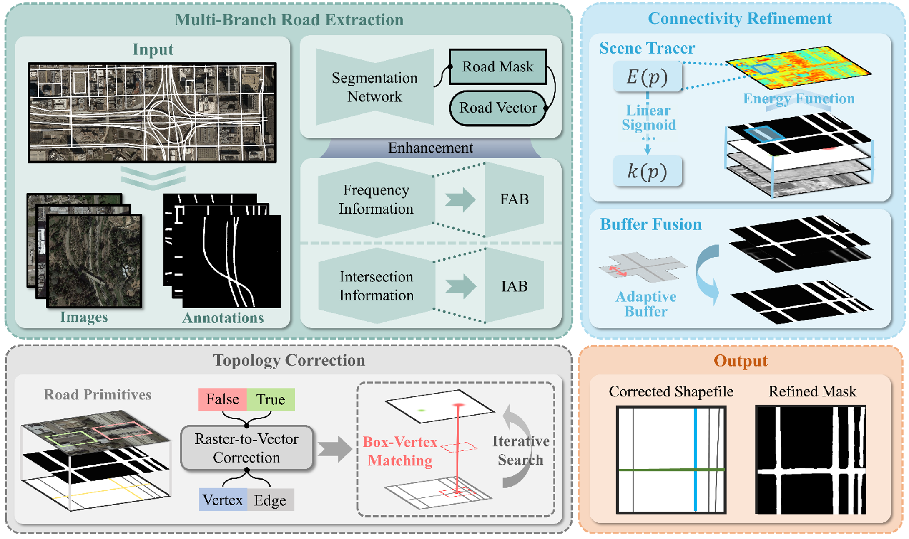

# RoadCorrector: An intersection-aware road extraction method for road connectivity and topology correction

## Abstract
  Road extraction from high-resolution remote sensing images has been an important research problem for decades. Due to the challenges such as the occlusion of trees and the stacking of multiple roads in complex scenes, existing road extraction methods still suffer from generating broken road surfaces, inaccurate topology and connections, etc. In this work, we propose a new road extraction method, named RoadCorrector, which solves the above limitations of existing methods via adding a road intersection detection network and two road correction modules. Specifically, RoadCorrector contains three main modules, i.e., intersection detection and road extraction, connectivity refinement, and topology correction. Based on the outputs of road extraction and intersection detection, the connectivity refinement module enables the complementary advantages of road segmentation and centerline tracking through the constraints of energy function, which enhances the road connectivity in the occluded and intersection regions. The topology correction module aims at constructing more accurate road connection relations, producing the final vectorized road network with more accurate topology information. Experimental results show that our proposed method achieves remarkable improvements compared with state-of-the-art methods, with the F1-score and intersection over union (IoU) improved by 1.1%-7.9% and 1.6%-11.3%, respectively. Moreover, the road network extraction results of RoadCorrector have more accurate connection relations and topology, demonstrating its great potential in actual application scenes. 

   

## Dataset Preparation

This repo is tested on [RoadTracer dataset](https://roadmaps.csail.mit.edu/roadtracer) and DeepGlobe dataset. Users need to download the Dataset and place it in the Dataset folder.

## Road Extraction

Users can obtain the road segmentation maps via our proposed MBRE-Net, and obtain the road centerline maps via centerline-tracking method (e.g. RoadTracer, vecroad), which are then fused and enhanced through the subsequent steps. The pre-trained models of the above two methods are provided in this repo. Code will be released soon.

## Contact us

For any questions,please contact us via lijp57@mail2.sysu.edu.cn or hejun36@mail2.sysu.edu.cn.

